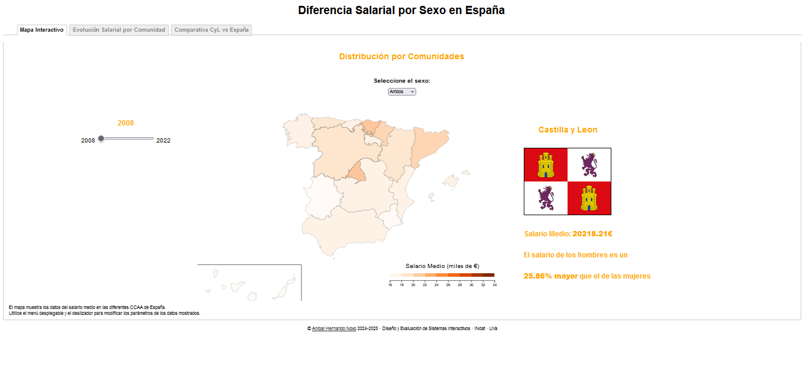
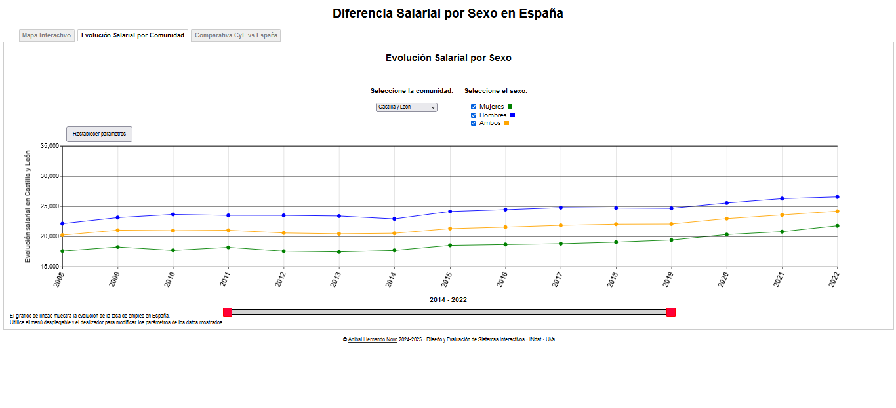
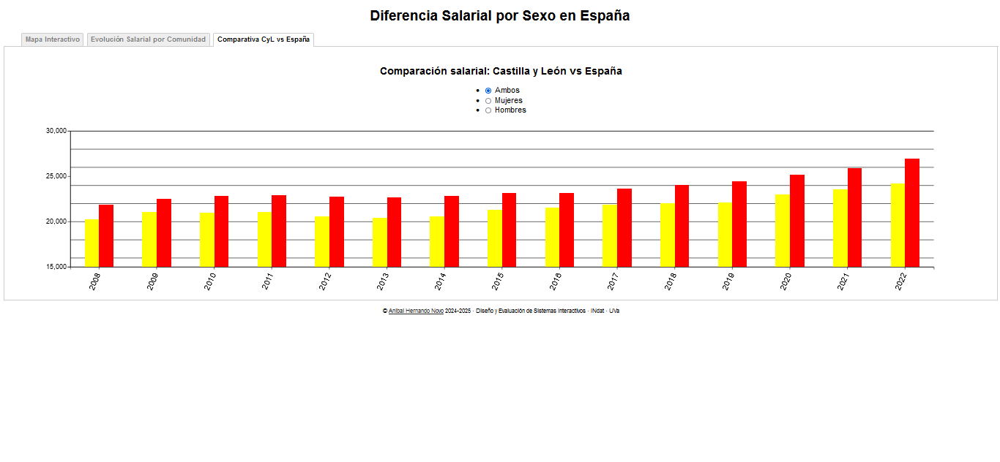

# Diferencia Salarial por Sexo en España

### Curso 2024/2025 - Diseño y Evaluación de Sistemas Interactivos

### Autor: Aníbal Hernando Novo

## Comparación Salarial en España

Se quiere estudiar la brecha salarial de la población española entre las diferentes comunidades autónomas y dentro de estas diferenciarla por sexo. 
Para ello, se va a analizar las diferencias de salario medio bruto en cada comunidad a través de diferentes visualizaciones. Además, se mostrará la desigualdad salarial entre el sueldo medio bruto a nivel nacional (España) y Castilla y León.
El objetivo es mostrar la clara disparidad en los salarios entre hombres y mujeres en cada una de las comunidades autónomas, recalcando que en ninguna el salario promedio de las mujeres supera al de los hombres. 
Por último, se pretende exponer que los jóvenes de Castilla y León tienen peores salarios que la media nacional lo que les lleva a marcharse a buscar mejores oportunidades, dejando a Castilla con un futuro incierto.

## Datos

Para la visualización se han utilizado los datos del dataset Spain Salary Distribution referenciado posteriormente.
Este dataset contiene estadísticas sobre la distribución del ingreso bruto anual por comunidades y por sexo de la población española entre 2008 y 2022.  

## Visualización

La visualización consiste en 3 gráficos diferentes:

#### Mapa Interactivo

En primer lugar encontramos un mapa coroplético de España separado por comunidades coloreadas según el salario bruto de la población, con la posibilidad de separar por sexos (mujer, hombre o ambos). Existe una leyenda que orienta mediante el tono de color los valores de los salarios.

Al situarnos sobre el territorio de cada comunidad en el mapa nos aparecerá más información sobre ella, como 
la bandera y el nombre, el salario medio y únicamente en el mapa de ambos sexos, la diferencia salarial en porcentaje entre el salario masculino y femenino. 

El slider del año que se encuentra a la izquierda del mapa, permite modificar el año (2008 a 2022) y comprobar el sueldo a lo largo de los años.

La selección del sexo se realiza mediante un desplegable encima del mapa.

#### Line Chart

Por otro lado, un gráfico de líneas muestra la evolución por años de los salarios brutos para los diferentes sexos, los cuales se podrán modificar mediante checkboxes que están encima del mapa.
Al lado de los checkboxes, se incluye un desplegableque que permite seleccionar la comunidad, para mostrar los datos correspondientes a la comunidad que queremos analizar.
Se incluye también un slider con doble handler, con el que el usuario podrá seleccionar exactamente el intervalo de tiempo que más le interese.

#### Bar Chart

Por último, un gráfico de barras de colores muestra una comparativa entre salarios de Castilla y León y España a lo largo de los años, donde la barra amarilla indica el salario medio de Castilla y León y la roja el de España. 
También habrá unos checkboxes con los que se puede mostrar los datos para los diferentes sexos.

## Referencias

Los datos se han obtenido de este [dataset de Kaggle](https://www.kaggle.com/datasets/jtljtl/spain-salary-distribution).  
Para la realización de este proyecto me he inspirado en el proyecto de un compañero (Pablo de Arriba Mendizábal).  
He utilizado elementos para modificar diferentes parámetros, los cuales provienen de la librería [jQuery](https://jquery.com/ "jQuery").

